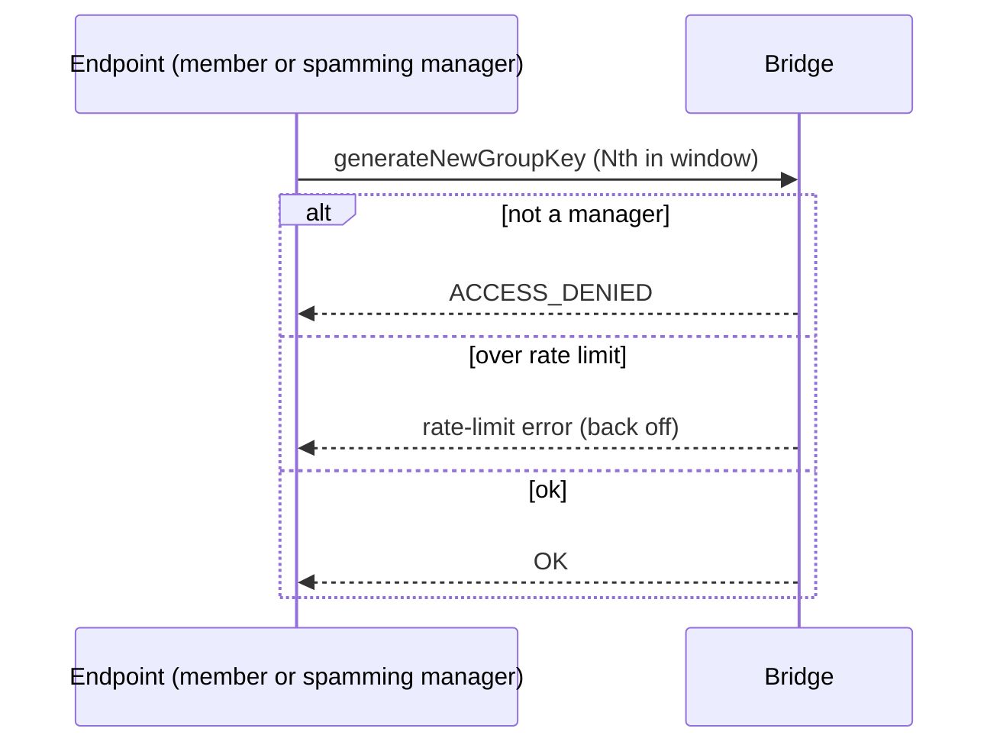

# 03 — Bridge-side flows (Phase 2)

Server-side sequences. The bridge stores opaque blobs and enforces concurrency/coverage/rate-limit only.
EP = endpoint, BR = bridge.

---

## 1. `generateNewGroupKey` (rekey, no membership change)

```mermaid
sequenceDiagram
  participant EP as Endpoint (manager)
  participant BR as Bridge
  participant DB
  EP->>BR: context.generateNewGroupKey { id, groupPubKey', data', keyId', keys'[], expectedKeyVersion: v, confirmationTag? }
  BR->>BR: ACL (manager); rate-limit; coverage over current members for keyId'
  BR->>DB: casRotate(id, where keyVersion=v): set groupPubKey', data', keyId', keys'; keyVersion=v+1; push oldPub→keyHistory
  alt CAS ok
    BR-->>EP: OK
    BR-->>EP: groupUpdated event (members)
  else CAS miss (someone rotated to v+1 already)
    BR-->>EP: ROTATED_ALREADY { keyVersion: v+1, groupPubKey'', winnerKeyEntry(for caller) }
  end
```

---

## 2. Removal = membership update, THEN a separate rotation

Removal and rotation are **two ops**. `groupUpdate` drops the member (and rotates the *data* key so they lose
group data); a follow-up `generateNewGroupKey` (§1) rotates the *identity* epoch so they lose container access.

```mermaid
sequenceDiagram
  participant EP as Endpoint (manager)
  participant BR as Bridge
  participant DB
  Note over EP,BR: step 1 — drop the member (NO epoch bump; groupPubKey UNCHANGED)
  EP->>BR: context.groupUpdate { id, users'(−removed), groupPubKey(SAME), data', keyId'(new data key), keys'(remaining), version, force }
  BR->>BR: ACL; reject if groupPubKey changed (INVALID_PARAMS); version check; coverage over remaining members
  BR->>DB: append history entry; keyVersion/keyHistory carried forward UNCHANGED
  BR-->>EP: OK ; groupUpdated (incl. removed) ; removed member SERVER-BLOCKED immediately
  Note over EP,BR: step 2 — rotate the identity epoch (forward secrecy) — see §1
  EP->>BR: context.generateNewGroupKey { id, groupPubKey'(fresh), …, expectedKeyVersion: v }
  BR->>BR: casRotate(keyVersion=v→v+1); push oldPub→keyHistory
  BR-->>EP: OK   (or ROTATED_ALREADY on CAS miss)
```

A pure **add** is also just a `groupUpdate` (no epoch bump, `version` check only). The only thing that bumps
the epoch is `generateNewGroupKey`.

---

## 3. Concurrent rotation — one winner, losers get the envelope

```mermaid
sequenceDiagram
  participant A as Endpoint A
  participant B as Endpoint B
  participant BR as Bridge
  A->>BR: rotate { expectedKeyVersion: 5, keysA[] }
  B->>BR: rotate { expectedKeyVersion: 5, keysB[] }
  BR->>BR: findOneAndUpdate(where keyVersion=5) — atomic; A wins
  BR-->>A: OK (keyVersion now 6)
  BR-->>B: ROTATED_ALREADY { keyVersion:6, groupPubKey(A), winnerKeyEntry = keysA[entry for B] }
  Note over B: B verifies + adopts A's epoch-6 key, retries its op (no extra round trip)
```

The bridge just returns the entry it already stored from A's winning write — no crypto, no forgery surface.

---

## 4. Container re-key with group grantees — per-epoch coverage

```mermaid
sequenceDiagram
  participant EP as Endpoint (container manager)
  participant BR as Bridge
  EP->>BR: thread.threadUpdate { keyId'', groups:[g], groupKeys:[{g, groupEpoch: E, keyId'', data}] , keys'' }
  BR->>BR: fetch g.keyVersion (current epoch)
  BR->>BR: coverage: exactly grantee {g} covered for keyId''; AND groupEpoch E == g.keyVersion
  alt stale epoch (E < g.keyVersion) or missing/extra grantee
    BR-->>EP: INVALID_PARAMS
  else ok
    BR->>BR: store; serve to current members of g
    BR-->>EP: OK
  end
```

This is what forces a re-keyer to wrap `CK` to the group's **current** epoch pubkey, so a removed member
(excluded from the current epoch) cannot read post-removal content even if a sloppy client tried to re-use an
old epoch.

---

## 5. Rate-limit / spam rejection



---

## 6. What the bridge still does NOT do
- It does **not** verify any signature, DIO, chain link, confirmation tag, or epoch↔pubkey binding — those are
  the endpoint's (committed in `data`, verified client-side). The bridge's Phase-2 additions are purely
  **epoch metadata + CAS + coverage + rate-limit**. See [README.md](./README.md) "Consistency with the
  store-only model".
