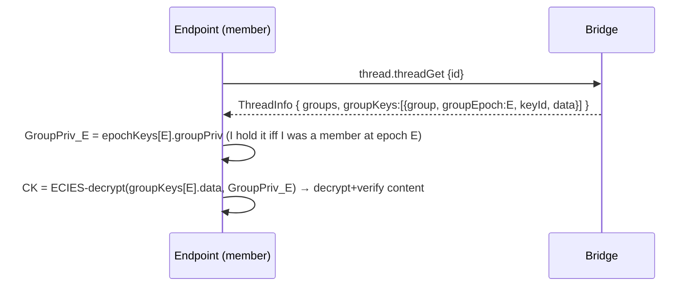

# 04 — Endpoint Phase 2 flows (what changes vs Phase 1)

EP = endpoint, BR = bridge. Everything builds on the Phase-1 flows
([../endpoint_phase_one/05-flows.md](../endpoint_phase_one/05-flows.md)); only the epoch/FS deltas are shown.

---

## 1. Remove a member → TWO ops (membership, then rotation)

Rotation is **decoupled from `groupUpdate`** (it's `generateNewGroupKey`, which can't change members). A
secure removal is therefore two calls: drop the member, then rotate the epoch.

```mermaid
sequenceDiagram
  participant EP as Endpoint (manager)
  participant BR as Bridge
  EP->>BR: context.groupGet {id} ; verify history (+epoch checks) ; current epoch = e
  Note over EP,BR: step 1 — drop the member (identity key UNCHANGED, no epoch bump)
  EP->>EP: membership_m = {users−removed, ..., groupPubKey: SAME, keyId_m(new data key), keyVersion: e, prevEntryHash:H}
  EP->>BR: context.groupUpdate { groupPubKey:SAME, users−removed, keyId_m, keys(remaining), version }
  BR-->>EP: OK ; groupUpdated (incl. removed) ; removed member SERVER-BLOCKED immediately
  Note over EP,BR: step 2 — rotate the identity epoch (forward secrecy)
  EP->>EP: (GroupPub',GroupPriv')=fresh ; Gk'=fresh ; e'=e+1 ; membership'={...,groupPubKey:GroupPub',keyVersion:e'} ; confTag
  EP->>BR: context.groupGenerateNewKey { groupPubKey:GroupPub', data', keyId', keys'(current members), expectedKeyVersion:e, confTag }
  alt CAS ok
    BR-->>EP: OK (epoch e')
  else lost race
    BR-->>EP: ROTATED_ALREADY { winner envelope } → adopt + retry (flow §4)
  end
```

Removed member holds keys ≤ epoch `e`; cannot read epoch `e'` group content. **FS of group content done.**

---

## 2. Lazy re-key a container on next write (NEW — the FS-for-containers flow)

```mermaid
sequenceDiagram
  participant EP as Endpoint (writer)
  participant BR as Bridge
  EP->>BR: getGroup(g) for each grantee g ; verify → currentEpoch(g)
  EP->>EP: stale = container.groupKeys(g).groupEpoch < currentEpoch(g) ?
  alt stale (group churned since last wrap)
    EP->>EP: CK'=fresh,keyId' ; for each g: wrap CK' to g.currentVerifiedGroupPubKey, tag groupEpoch=currentEpoch(g)
    EP->>EP: confTag=MAC_CK'(...)
    EP->>BR: thread.threadRotateKey { id, keyId', keys'[...], groupKeys'[...], version, force }   (dedicated rotate — no membership change)
    BR->>BR: BR-5 per-epoch coverage: groupEpoch == g.keyVersion & exact grantees → store (re-wraps to CURRENT members)
    BR-->>EP: OK   (then write new content under CK')
    Note over EP,BR: thread has threadRotateKey; store/inbox/kvdb/stream re-key via *Update until they get one
  else fresh
    EP->>EP: reuse current CK (cheap write)
  end
```

After this write, the removed member (excluded from `g`'s current epoch) cannot read the new content. Detail:
[03-lazy-rekey.md](./03-lazy-rekey.md).

---

## 3. Read with epoch-tagged key selection (CHANGED from Phase 1 §3)



If `epochKeys[E]` is absent (joined after epoch E, no history granted) → correctly no access to that older
content. `keyHistory` maps `E → GroupPub_E` for labelling/verification.

---

## 4. Concurrent rotation → adopt winner, retry (NEW)

```mermaid
sequenceDiagram
  participant A as Endpoint A
  participant B as Endpoint B
  participant BR as Bridge
  A->>BR: rotate { expectedKeyVersion:5 }
  B->>BR: rotate { expectedKeyVersion:5 }
  BR-->>A: OK (epoch 6)
  BR-->>B: ROTATED_ALREADY { keyVersion:6, groupPubKey(A), winnerKeyEntry(for B) }
  B->>B: verify+decrypt winnerKeyEntry → Gk6 ; getGroup → GroupPriv6 ; verify confTag
  B->>B: epochKeys[6] = {GroupPriv6, Gk6} ; retry original op against epoch 6
```

No extra round trip for the key. Detail: [02-rotation-cas-confirmation.md](./02-rotation-cas-confirmation.md) §2.

---

## 5. Verify on read (CHANGED — add epoch checks to Phase-1 replay)

Phase-1 replay (DIO + G1 chain + G2 manager-auth + member cross-check + UserVerifier) **plus**:
- `membership[i].keyVersion` monotonic, increments exactly on `groupPubKey` change;
- bridge top-level `keyVersion` == head `membership.keyVersion`; `keyHistory` entries match the pubkey
  committed at each epoch's first version.

So epochs are **client-verified**, not merely trusted from the bridge CAS field. Detail:
[01-epochs.md](./01-epochs.md) §4.

---

## 6. New-vs-reused (Phase 2 endpoint)

| Flow | New code | Reused |
|------|----------|--------|
| remove → new epoch (§1) | fresh-epoch keypair, wrap-to-remaining, confTag | Phase-1 update build, DIO, key wrap |
| lazy re-key (§2) | staleness check + wrap CK to current verified epoch pubkeys | container write path, `EncKeyEncryptorV2` |
| read selection (§3) | pick key by `groupEpoch`/`keyVersion` | container DIO/UserVerifier, key cache |
| ROTATED_ALREADY (§4) | catch-adopt-retry | `KeyProvider` verify of the envelope |
| verify (§5) | monotonic-epoch + keyHistory checks | Phase-1 replay (G1/G2/G3) |

Recurring theme: epochs are **bookkeeping + the lazy-re-key algorithm** on top of unchanged crypto. No PCS, no
ratchet tree, no commit-replay engine.
