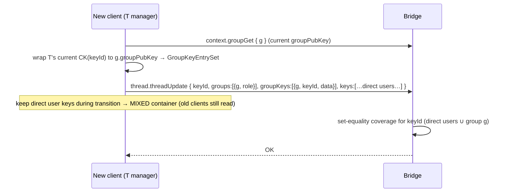

# 07 — Backward compatibility & migration

> Status legend in [README.md](./README.md). This is the analysis the feature was designed around. Working
> assumption (stated by the project): **no older client version needs to access a "new" (group-dependent)
> container** — older versions may receive app exceptions. We only guarantee that the feature is **additive**
> and never breaks old clients on the containers they already use.

---

## 1. Definitions

- **Old client** — a bridge/endpoint build with no knowledge of groups (doesn't send `groups`/`groupKeys`,
  doesn't understand the `group` namespace).
- **New client** — understands groups, the signed log, and group-as-grantee.
- **Old container** — a thread/store/inbox/kvdb/stream with **no group grantees** (`groups`/`groupKeys`
  absent or empty); access is purely by direct `users`/`managers`.
- **New container** — a container that lists at least one **group** in `groups` and whose content key is
  (partly or wholly) wrapped only to a `groupPubKey`. A new container is "group-dependent" when a reader can
  *only* reach the `CK` via group membership (no direct user key entry for them).

A container can also be **mixed**: it grants to a group **and** keeps direct user key entries. Mixed
containers are the bridge that makes migration safe (see §3).

---

## 2. The additive-field contract (why old clients keep working)

The whole compatibility story rests on three verified facts:

1. **New container fields are OPTIONAL in the validators.** `groups` and `groupKeys` on every container
   `*Create`/`*Update` are `builder.optional(...)`. An old client that never sends them passes validation
   unchanged. *(Verified in `ThreadApiValidator` and the other four.)*
2. **New container fields are OPTIONAL in the DB model.** `groups?`/`groupKeys?` on every container doc.
   Existing documents written before the feature simply lack them; reads treat absent as `[]`. **No
   migration/backfill of existing data is required.**
3. **Responses always include the fields (possibly empty).** `ThreadInfo.groups`/`groupKeys` are required in
   the read shape, so a new client always gets `[]` for old containers. Old clients ignore the extra response
   fields (the RPC clients are tolerant of unknown fields — additive output is non-breaking).

**Rule for all future changes to these structures:** additive + optional only. Never rename an existing
field, never change an existing field's type, never make a previously optional field required. Doing so is
the only way to break old clients on old containers.

---

## 3. Compatibility matrix

| Client \ Container | Old container (direct users only) | Mixed (direct users **and** group) | New / group-dependent (group only) |
|---|---|---|---|
| **Old client** | ✅ full read/write as today | ✅ reads via its **direct** user key; ignores `groups`/`groupKeys` | ⚠️ **no access** — has no group key; surfaces decrypt/no-key error (acceptable per assumption) |
| **New client** | ✅ full read/write (treats group fields as empty) | ✅ reads via direct key **or** group key | ✅ reads via group membership |

Notes:
- **Old client + old container:** untouched. The feature adds nothing to this path. This is the dominant
  production case and must stay byte-for-byte compatible — guaranteed by §2.
- **Old client + mixed container:** works **iff** the old client is in the container's direct `users`/
  `managers` with its own key entry. If it is only reachable via the group, it's the group-dependent case.
- **New client + old container:** works; `getCallerGroupIds` returns no group for that container, the `$or`
  falls back to the direct branches, group fields convert to `[]`.
- **Old client + group-dependent container:** the bridge may still **list** it to the old client if that
  client happens to be a member of the granting group (server access ⊇ crypto access, doc 03 §4.2). The old
  client then fails to decrypt. This is the one user-visible rough edge; it is **acceptable** under the
  project assumption but should be handled gracefully by the app (show "update required" rather than a crash).

---

## 4. Capability negotiation / version gating

Because old clients can't decrypt group-dependent containers, **the app decides when it is safe to make a
container group-dependent**:

- **Keep mixed during transition.** Grant to the group *and* retain direct user key entries for any users who
  might still be on old clients. Everyone can read; new clients additionally benefit from group resolution.
- **Cut over to group-only** for a container only once all its relevant readers are on new clients (gate on
  the endpoint's advertised protocol/version, or on an org-level "minimum client version" policy).
- The bridge does not enforce client version — it serves whatever is asked. Gating is an **endpoint/app**
  concern, informed by the version handshake. The new endpoint should advertise group support so apps can
  query it. (Doc 06 §11.)

---

## 5. The "server access ⊇ crypto access" edge (must handle in the app)

The bridge grants list/get visibility to any **current** member of a granting group, including old clients
that can't decrypt. Two implications:

1. **Old client sees an undecryptable container.** Handle in the app as "needs newer client", not an error
   loop.
2. **Just-removed member, pre-re-key window.** Server-blocked immediately (✅), but if they cached the old
   `CK`, new content is only cryptographically hidden after the lazy re-key (🟡🔵, doc 05 §4/§5c). Treat the
   server block as the authoritative access control and the re-key as the forward-secrecy hardening; don't
   conflate them.

---

## 6. Migrating an existing (old) container to use a group

This is a normal `*Update`, no data rewrite or downtime. To add a group `g` to thread `T`:

Steps:
1. `getGroup(g)` for the current `groupPubKey`.
2. Wrap the **current** `CK` to `g.groupPubKey` (no need to rotate `CK` just to add a reader-group — reuse
   the existing `keyId`). Produce `GroupKeyEntrySet {group:g, keyId, data}`.
3. `threadUpdate` with `groups` (+ `groupKeys`) **and** the existing direct-user `keys`. → **mixed**.
4. Later, when all readers are new clients, do a second `threadUpdate` that **drops the direct user key
   entries** (and ideally rotates `CK` so removed direct grants lose future access) → **group-dependent**.

**Reverse migration (new → old)** is symmetric: `threadUpdate` removing `groups`/`groupKeys`, re-adding
direct user key entries. You lose the group benefit but regain old-client access. Possible at any time.

> Re-keying choice: adding a reader-group can reuse the current `CK` (cheap). Removing a group or dropping
> direct grants should rotate `CK` if you want the dropped parties excluded from future content (lazy or
> eager re-key, doc 05 §5c).

---

## 7. Bridge upgrade / rollout sequencing

- **Bridge first, then clients.** Deploying the bridge with group support is safe for old clients (§2): the
  new RPC methods are simply never called, and the new optional fields are never sent. No data migration runs
  on deploy.
- **No backfill.** Existing container documents need no change. The `group` collection starts empty.
- **Indexes** (doc 03 §3) should be created as part of the rollout, before groups see real use, so the
  membership-resolution queries don't scan.
- **Policy defaults** for `ContextPolicy.group` are supplied by `PolicyService` for contexts created before
  the feature — no per-context migration needed.
- **Rollback:** since nothing is rewritten, rolling the bridge back is safe **as long as no group-dependent
  containers exist yet**. Once a container is group-only, an old bridge cannot serve its access correctly →
  treat "first group-dependent container" as the point of no easy rollback, and gate GA accordingly.

---

## 8. 🟡 Forward-compat with the MLS-lite epoch model and full MLS

- The epoch fields (`keyVersion`/`keyHistory`, `groupEpoch` on container entries) are themselves **additive**
  — a pre-epoch group is `keyVersion` absent ⇒ treat as epoch 1; a pre-epoch container entry is `groupEpoch`
  absent ⇒ treat as "matches current" (never stale until first rotation). So introducing epochs does not
  break already-created groups/containers.
- Evolving lite-v1 → full MLS without breaking the data layer is analysed in
  [../group-mls-lite-plan.md](../group-mls-lite-plan.md) §9: tag each group with a
  `keyAgreementProtocol` discriminator, keep the asymmetric group **grant** keypair stable, and let
  `lite-v1` and `mls-v1` groups **coexist** (existing groups stay lite; new groups can be MLS). In-place
  migration of a live group is *not* free and is not promised — coexistence is the non-breaking path.

---

## 9. Summary — the guarantees

1. **Old client + old container:** identical to pre-feature behaviour. *(Hard guarantee, from §2.)*
2. **Old client + mixed container:** works via the client's direct key. *(Hard guarantee.)*
3. **New client + any container:** works (group fields default to empty for old containers).
4. **Old client + group-dependent container:** **no access** by design (app should prompt to upgrade). *(By
   assumption — acceptable.)*
5. **No data migration/backfill** to deploy the feature; **migration of a container is a normal update**, and
   can be done gradually via the mixed state.
6. **Don't break the additive contract** (§2) and all of the above continues to hold.
